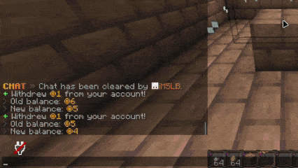

# Configuration Guide

RelishEconomy uses multiple YAML files under `plugins/RelishEconomy/`.

## Main Config (`config.yml`)

Key settings:

```yaml
config-version: 3
license-key: ""
debug-mode: false
check-for-updates: true
metrics:
  enabled: true
language: en
```

### Database

```yaml
database:
  type: sqlite            # sqlite | mysql
  real-time-read: false   # enable only if balances change externally
  mysql:
    host: localhost
    port: 3306
    database: relisheconomy
    username: root
    password: password
  schema:                 # advanced (optional)
    balances:
      table: balances
      columns:
        uuid: uuid
        player_name: player_name
        discord_id: discord_id
        currency: currency
        balance: balance
        last_modified: last_modified
```

### Limits and Cooldowns

```yaml
baltop-cache-duration: 300
pay-cooldown: 3
max-balance: 999999999.99
min-transaction: 0.01
```

### Block Interactions (Premium GUIs)

```yaml
sell-gui-block: COMPOSTER
shop-gui-block: EMERALD_BLOCK

composter-selling:
  enabled: true
  cooldown: 500
```

### Exchange

Exchange rates are configured per currency:

```yaml
exchange-fee-percentage: 2.5
currencies:
  dollars:
    exchange-rates:
      coins: 0.01
```

### Currencies

Each currency supports per-currency formatting, permissions, exchange rates, and physical currency templates.

```yaml
currencies:
  dollars:
    name: "dollars"
    symbol: "$"
    display-name: "Dollars"
    color: "<green>"
    default: true
    starting-balance: 100.0
    payments-enabled: true
    permission: ""
    decimals-enabled: true
    exchange-rates:
      coins: 0.01
    physical-item:
      material: PAPER
      deposit-enabled: true
      withdraw-enabled: true
      name: "<green><bold>Dollar Bill"
      lore:
        - "<gray>Value: {formatted_amount}"
        - "<gray>Owner: <white>{owner}"
        - ""
        - "<yellow>Shift + Right-Click to deposit"
      custom-model-data: -1
      glow: false
      unbreakable: false
    crafting:
      enabled: false
      value: 100.0
      amount: 1
      shape:
        - "PPP"
        - "PIP"
        - "PPP"
      ingredients:
        P: PAPER
        I: INK_SAC
```

Notes:
- Physical currency (`/withdraw`, deposit) is a Premium feature, but its per-currency templates and crafting recipes are configured here.
- `custom-model-data` is applied to the physical currency item meta when `>= 0`.

### Custom Model Data (Resource Pack Example)

RelishEconomy does not require any extra plugin for custom models. It simply sets `CustomModelData` on the currency item.



To make it render as a custom coin/note, you must:
- Set `custom-model-data` to a number (>= 0) for the currency
- Provide a resource pack override for the chosen `material`
- Make sure players use the resource pack (server resource pack recommended)

Bundled defaults enable a `CustomModelData` value for the coins currency. If you don't use a resource pack, it will still render as the normal item material.

```yaml
currencies:
  coins:
    physical-item:
      material: GOLD_NUGGET
      custom-model-data: 2001  # set to -1 to disable
```

To change the model, set `custom-model-data` to your resource pack value, then update your resource pack.

Minecraft 1.21+ item model override example (`assets/minecraft/items/gold_nugget.json`):

```json
{
  "model": {
    "type": "range_dispatch",
    "property": "custom_model_data",
    "index": 0,
    "entries": [
      {
        "threshold": 1234.0,
        "model": {
          "type": "model",
          "model": "minecraft:item/custom/coin_1234"
        }
      }
    ],
    "fallback": {
      "type": "model",
      "model": "minecraft:item/gold_nugget"
    }
  }
}
```

Tip: Always keep a valid `fallback` model (like `minecraft:item/gold_nugget`) so normal gold nuggets keep their texture when `CustomModelData` does not match.

## Prices (`prices.yml`)

Sell system toggle and sell prices:

```yaml
sell:
  enabled: true
target-currency: "dollars"
prices:
  STONE: 0.5
  DIAMOND: { price: 100.0, currency: "coins" }
```

## Shop (`shop.yml`) (Premium)

Shop settings + categories + optional custom/NBT items.

```yaml
shop:
  enabled: true
  buy-currency: "dollars"     # legacy/default
  buy-multiplier: 2.0
  items-per-page: 28
  categories-enabled: true
  search-enabled: true
  show-unpriced-items: false  # show unpriced items as disabled

custom-items: {}

categories:
  building_blocks:
    display-name: "Building Blocks"
    icon: STONE
    description: "Core structural materials and masonry"
    enabled: true
    slot: "1:0"               # page:slot
    items:
      - STONE
      - COBBLESTONE
      - BRICKS
```

Custom shop items:
- Stored under `custom-items` with a Base64 `ItemStack` payload.
- Referenced from categories using `custom:<id>`.

## GUI (`gui.yml`) (Premium)

GUI layout and sounds are configured in `gui.yml`, including:
- `shop-gui` (categories, items, favorites button)
- `shop-purchase-gui` (quantity picker + confirm/cancel + favorite toggle)
- `sell-gui`
- `logs-gui`
- batch add GUIs and dialogs
- `sounds.*` (GUI + transaction sounds)

## Config Updater / Validation

On startup and `/re reload`, RelishEconomy validates configs and can:
- restore missing bundled files (`config.yml`, `shop.yml`, `prices.yml`, `gui.yml`, `lang/*.yml`)
- merge missing keys into existing files without wiping your edits
- back up files before overwriting: `*-backup-YYYYMMDD-HHMMSS.yml`

If you intentionally reset configs by deleting `plugins/RelishEconomy/`, the validator will recreate missing files and may log warnings like `*.recreated` to make it obvious defaults were restored.
