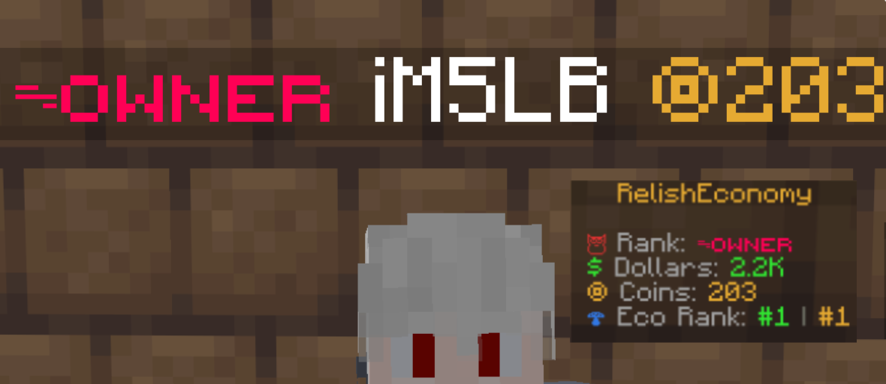

# PlaceholderAPI Integration

RelishEconomy provides PlaceholderAPI placeholders with a short cache (1s) to reduce load from scoreboards, chat formats, etc.



## Installation

1. Install PlaceholderAPI.
2. Install RelishEconomy.
3. Placeholders are registered automatically.

## Balance Placeholders

### Raw Balance

```text
%relisheconomy_balance%
%relisheconomy_balance_<currency>%
```

Returns the balance as a plain number.

Examples:
- `%relisheconomy_balance%` -> uses default currency
- `%relisheconomy_balance_dollars%` -> `1000.50`
- `%relisheconomy_balance_coins%` -> `25` (if `decimals-enabled: false`)

### Formatted Balance

```text
%relisheconomy_formatted%
%relisheconomy_formatted_<currency>%
```

Returns a formatted balance for display (typically includes currency symbol and color).

### Advanced Formatting (Type + Style)

```text
%relisheconomy_formatted_<currency>_<type>_<style>%
```

`type`:
- `compact` (default): `1.2K`, `3.4M`, `2B`
- `full`: full number with separators
- `raw`: numeric only (no currency symbol)

`style`:
- `colored` (default): uses currency color (and includes symbol except in `raw`)
- `plain`: numeric only (never includes symbol)

Examples:
- `%relisheconomy_formatted_dollars_compact_colored%` -> colored + `$` + compact number
- `%relisheconomy_formatted_dollars_compact_plain%` -> compact number only
- `%relisheconomy_formatted_dollars_full_plain%` -> full number only
- `%relisheconomy_formatted_dollars_raw_colored%` -> colored numeric only (no symbol)

Notes:
- `plain` never includes currency symbols.
- `raw` never includes currency symbols (even when `colored`).

Recommended pattern (clean scoreboards/tabs):

```text
%relisheconomy_currency_dollars_symbol%%relisheconomy_formatted_dollars_compact_plain%
%relisheconomy_currency_coins_symbol%%relisheconomy_formatted_coins_compact_plain%
```

## Leaderboard (Baltop) Placeholders

You can use `baltop`, `leaderboard`, or `top` as the prefix:

```text
%relisheconomy_baltop_...%
%relisheconomy_leaderboard_...%
%relisheconomy_top_...%
```

### Player Name / UUID

```text
%relisheconomy_baltop_<position>_<currency>_name%
%relisheconomy_baltop_<position>_<currency>_uuid%
```

### Balances

```text
%relisheconomy_baltop_<position>_<currency>_balance%
%relisheconomy_baltop_<position>_<currency>_raw%
```

Advanced formatting is supported on baltop balances:

```text
%relisheconomy_baltop_<position>_<currency>_balance_<type>_<style>%
%relisheconomy_baltop_<position>_<currency>_formatted_<type>_<style>%
```

Examples:
- `%relisheconomy_baltop_1_dollars_name%` -> `Steve`
- `%relisheconomy_baltop_1_dollars_balance%` -> formatted balance
- `%relisheconomy_baltop_1_dollars_balance_compact_plain%` -> compact number only
- `%relisheconomy_baltop_1_dollars_formatted_full_colored%` -> colored + `$` + full number

## Player Rank

```text
%relisheconomy_rank%
%relisheconomy_rank_<currency>%
```

Returns the player's rank in the leaderboard for that currency.

Notes:
- If the player is not in the cached top list, it returns `Unranked`.
- Baltop/rank placeholders follow your `baltop-cache-duration` setting and are refreshed automatically to avoid `N/A` outputs after server uptime.

## Currency Information

```text
%relisheconomy_currency%                       -> default currency name
%relisheconomy_currency_<currency>_name%
%relisheconomy_currency_<currency>_symbol%
%relisheconomy_currency_<currency>_display%
%relisheconomy_currency_<currency>_starting%
%relisheconomy_currency_<currency>_default%
```

## Utility Placeholders

### Has Enough

```text
%relisheconomy_hasenough_<amount>_<currency>%
```

Returns `true`/`false`.

### Exchange Rate

```text
%relisheconomy_exchangerate_<from>_<to>%
```

Returns the exchange rate (4 decimals) or `N/A` if exchange is not configured for that currency pair.

## Server Stats

```text
%relisheconomy_stats_currencies%
%relisheconomy_stats_accounts%
%relisheconomy_stats_dbtype%
%relisheconomy_stats_dbhealthy%
```

## Troubleshooting

Use PlaceholderAPI to test:

```text
/papi parse <player> <placeholder>
```

Common issues:
- Wrong currency name (use the internal name from `config.yml`)
- Typos in placeholder names
- Leaderboard position out of range
