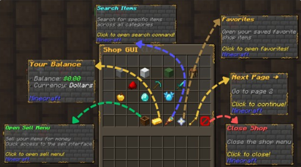
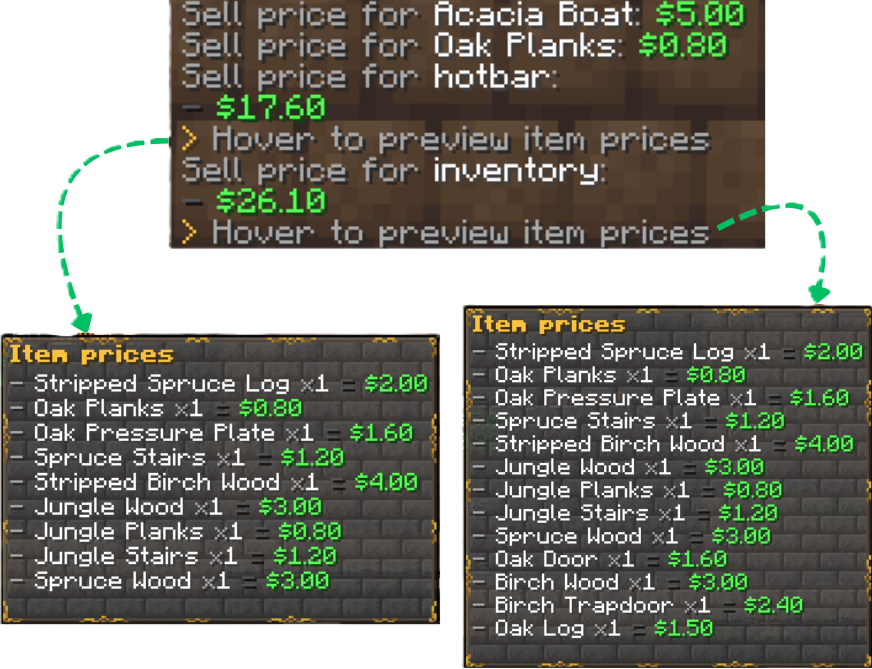

# Shop System (Premium)

RelishEconomy includes a category-based shop GUI driven by `shop.yml` (categories/items) and `prices.yml` (sell prices). GUI layout and sounds are in `gui.yml`.



## Opening the Shop

```text
/shop
/shop help
```

You can also open it by right-clicking the configured block:

```yaml
# config.yml
shop-gui-block: EMERALD_BLOCK
```

## Browsing

- Categories are defined in `shop.yml` under `categories:`
- Category placement uses `slot: "page:slot"`
- Pagination is controlled by `shop.items-per-page` (in `shop.yml`) and the GUI layout (in `gui.yml`)
- The bundled `shop.yml` layout follows the creative inventory tab order. Categories like operator utilities are disabled by default.

## Buying Items (Purchase GUI)

RelishEconomy uses a purchase GUI flow:

1. Click an item in the shop list to open the buy menu.
2. Increase/decrease quantity using the +/- buttons.
3. Confirm purchase, or go back/cancel (returns to the same category and page).
4. Toggle favorite from the buy menu.

The purchase GUI is configured in `gui.yml` under `shop-purchase-gui`.

## Favorites

- Players can favorite shop entries.
- Favorites are stored in `favorites.yml`.
- The shop GUI has a Favorites button which opens a dedicated Favorites view.
- Favorited entries are highlighted in the shop list (glow/enchanted effect).

## Unpriced Items (Optional)

If you want items without buy prices to still appear (as disabled), enable:

```yaml
# shop.yml
shop:
  show-unpriced-items: true
```

## Pricing Rules

- Sell prices are defined in `prices.yml`.
- Buy prices are calculated using the multiplier in `shop.yml`:

```yaml
# shop.yml
shop:
  buy-multiplier: 2.0
```

- Per-item currency is supported from `prices.yml`:

```yaml
# prices.yml
prices:
  DIAMOND: { price: 100.0, currency: "coins" }
```

## Custom / NBT Shop Items

Custom items are stored in `shop.yml` under `custom-items` and referenced using `custom:<id>` inside category item lists.

Recommended admin workflow:

```text
/re shop add @hand <category>
```

This saves the exact held ItemStack (including NBT/meta) and creates a `custom:<id>` entry for use in categories.

## Admin Category Management

```text
/re shop category list
/re shop category create <name> <display name> <icon> <page:slot>
/re shop category enable <name>
/re shop category disable <name>
/re shop category slot <name> <page:slot>
/re shop category remove <name> <item>
```

## GUI Customization

Edit `gui.yml`:
- `shop-gui` buttons (back/prev/next/balance/search/favorites/close)
- `shop-gui.shop-item` display and lore
- `shop-purchase-gui` preview, adjust buttons, confirm, back, favorite
- `sounds.*` for GUI + transaction audio

Reload after changes:

```text
/re reload
```

## Hover Price Breakdown

Some sell outputs include hover breakdowns showing exactly what was sold.


