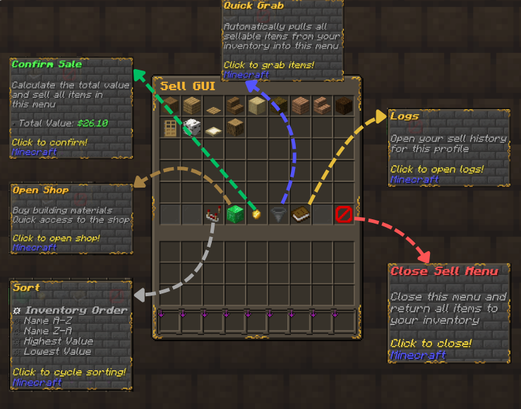

# RelishEconomy Documentation

## Quick Links

- [Installation](Installation.md)
- [Quick Start](QuickStart.md)
- [Configuration](Configuration.md)
- [Commands](Commands.md)
- [Shop System (Premium)](ShopSystem.md)
- [PlaceholderAPI](PlaceholderAPI.md)
- [Permissions](Permissions.md)
- [Changelog](CHANGELOG.md)

## What Changed Recently (1.0.9-Beta)

- Shop favorites + dedicated favorites view (`favorites.yml`)
- New purchase GUI flow (quantity selection + confirm/cancel/back)
- Expanded physical currency customization (custom model data + optional crafting)
- Config updater improvements (restore/merge/backup behavior)
- Placeholder formatting variants clarified (plain vs colored; raw has no symbol)
- PlaceholderAPI ranks no longer drop to `N/A` after uptime (baltop cache auto-refresh)
- Documentation + README refreshed for 1.0.9, with updated examples and screenshots

## Screenshots

